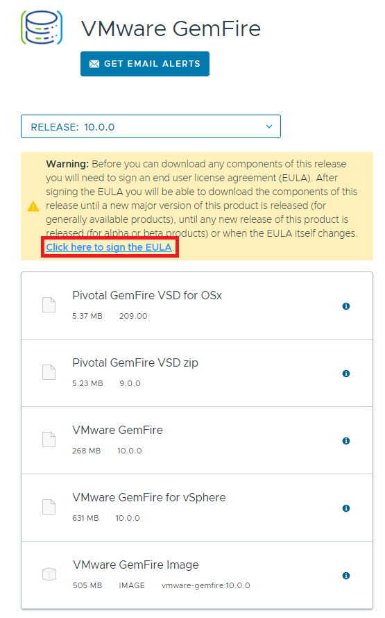
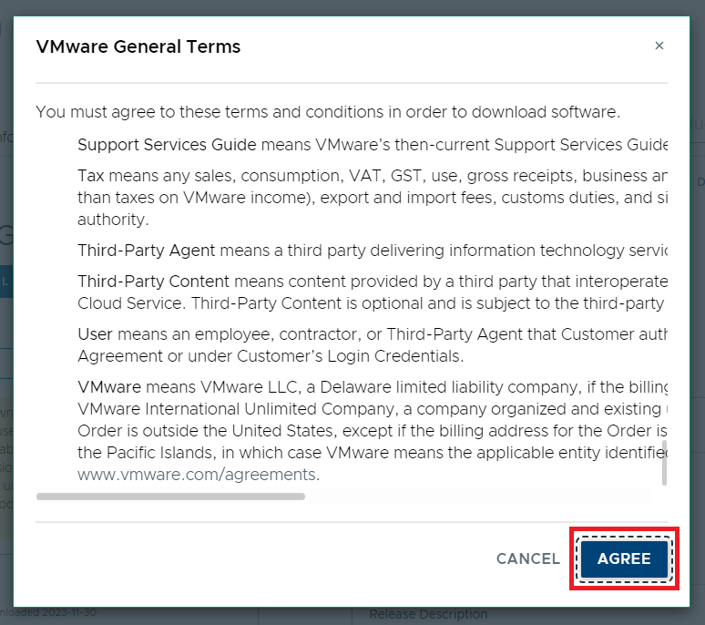

# 설치 전 사전 준비

Kubernetes용 VMware GemFire 이미지는 VMware Tanzu Network에서 제공하며,
Helm Chart와 Gemfire 이미지를 가져오기 위해선 VMware 소프트웨어 EULA 서명이 필요합니다.

먼저 [VMware Tanzu Network - VMware Gemfire For Kubernetes](https://network.tanzu.vmware.com/products/tanzu-gemfire-for-kubernetes)에 접속한 뒤, 로그인합니다.

VMware GemFire for Kubernetes의 EULA를 서명하기 위해 링크를 클릭합니다.

Agree 버튼을 클릭합니다.

VMware GemFire의 EULA를 서명하기 위해 [VMware Tanzu Network - VMware GemFire](https://network.tanzu.vmware.com/products/pivotal-gemfire)로 접속합니다.

VMware GemFire의 EULA를 서명하기 위해 링크를 클릭합니다.

Agree 버튼을 클릭합니다.

