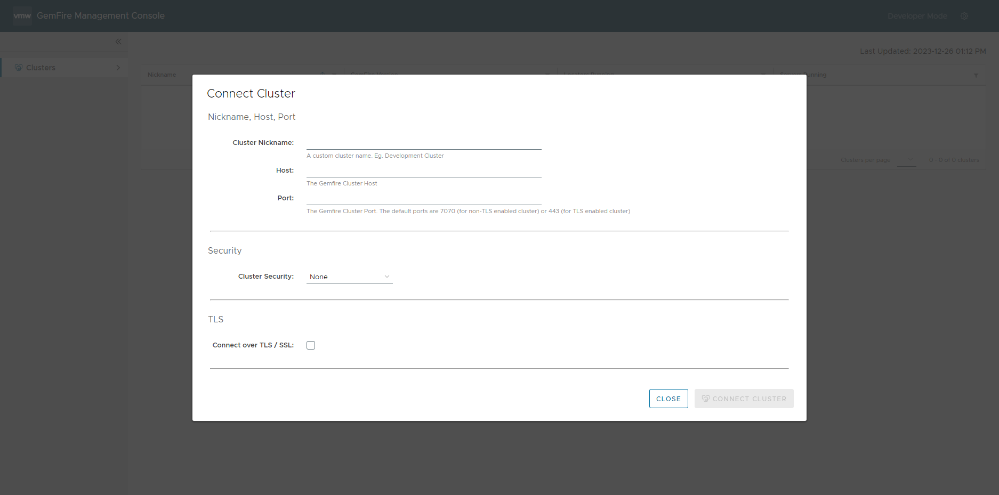
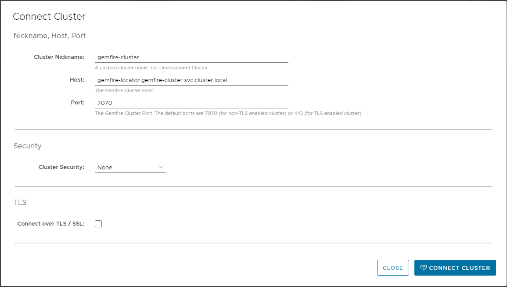

<br>

대시보드 접속 시 다음과 같이 Cluster를 연결하라는 팝업이 열립니다.



다음과 같이 입력하고 Connect Cluster 버튼을 클릭하여 연결합니다.



```
Cluster Nickname: gemfire-cluster
Host: gemfire-locator.gemfire-cluster.svc.cluster.local
Port: 7070
```