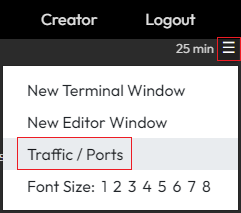
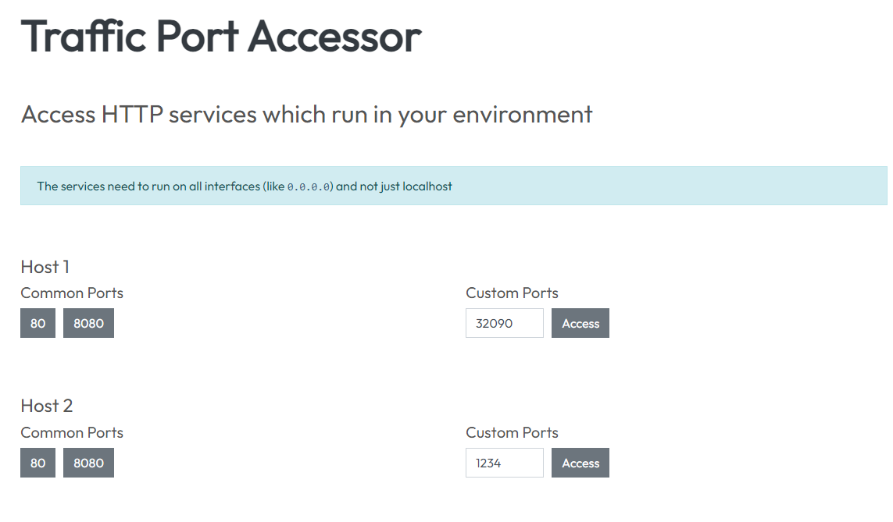
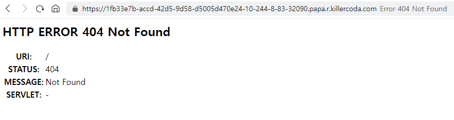
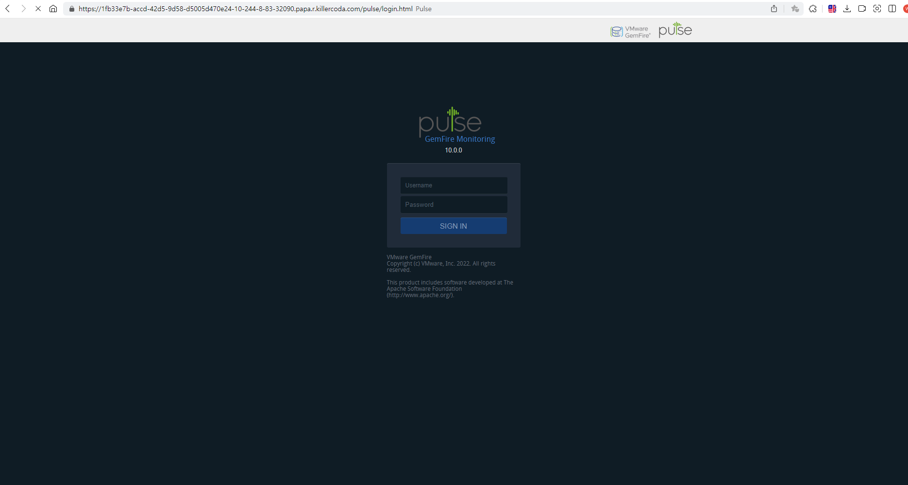
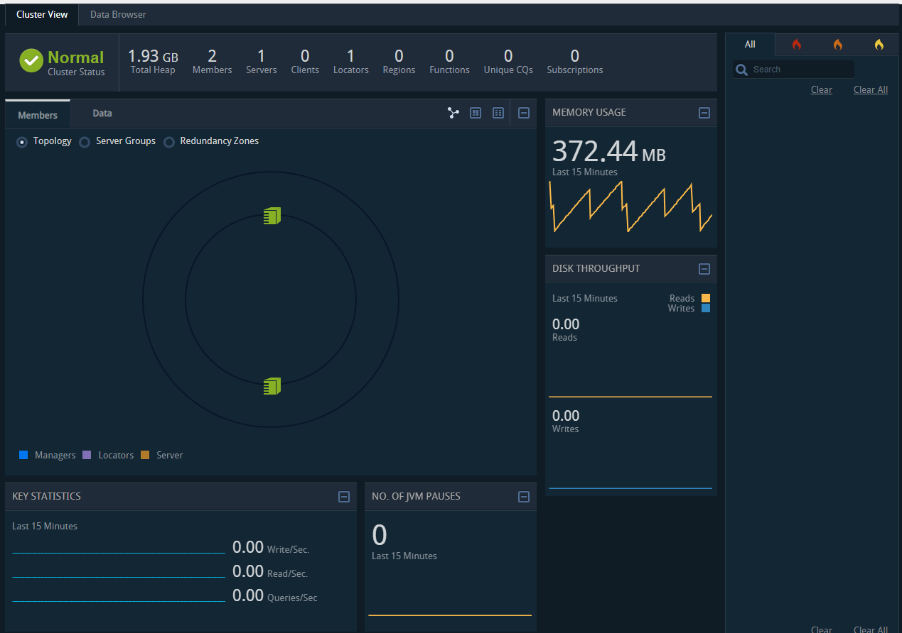

<br>

Gemfire Cluster를 설치할 Namespace를 생성합니다.
Namespace 명은 `gemfire-cluster`로 설정하였습니다.

`kubectl create namespace gemfire-cluster`{{exec}}

Kubernetes 클러스터 네임스페이스에 대한 이미지 풀 시크릿을 생성합니다.
레지스트리에서 운영자 이미지를 획득하는 데 사용될 사용자 이름(USERNAME) 및 암호(PASSWD) 자격 증명을 VMware Tanzu Network에 액세스할 수 있는 권한이 있는 값으로 설정합니다.

`kubectl create secret docker-registry image-pull-secret --namespace=gemfire-cluster --docker-server=registry.tanzu.vmware.com --docker-username='USERNAME' --docker-password='PASSWD'`

GemFire Cluster 설치 전 Server에 적용할 cache.xml 을 작성합니다.

`vi cache-config.yaml`{{exec}}

```yaml
apiVersion: v1
kind: ConfigMap
metadata:
  name: cache-config
  namespace: gemfire-cluster
data:
  cache.xml: |
    <?xml version="1.0" encoding="UTF-8"?>
    <cache xmlns:xsi="http://www.w3.org/2001/XMLSchema-instance" xmlns="http://geode.apache.org/schema/cache"
           xsi:schemaLocation="http://geode.apache.org/schema/cache http://geode.apache.org/schema/cache/cache-1.0.xsd"
           version="1.0" lock-lease="120" lock-timeout="60" search-timeout="300" is-server="false" copy-on-read="false">

        <pdx read-serialized="true" ignore-unread-fields="true" persistent="true" />
    </cache>
```{{copy}}

작성한 configMap을 생성합니다.

`kubectl create -f cache-config.yaml`{{exec}}

GemFireCluster를 작성합니다.

`vi gemfire-cluster.yaml`{{exec}}

```yaml
apiVersion: gemfire.vmware.com/v1
kind: GemFireCluster
metadata:
  name: gemfire
  namespace: gemfire-cluster
spec:
  image: registry.tanzu.vmware.com/pivotal-gemfire/vmware-gemfire:10.0.0
  security:
    tls: {}
  locators:
    replicas: 1
  servers:
    replicas: 1
    overrides:
      statefulSet:
        spec:
          template:
            spec:
              tolerations:
                - key: "node-role.kubernetes.io/control-plane"
                  operator: "Exists"
                  effect: "NoSchedule"
              containers:
                - name: server
                  volumeMounts:
                    - name: cache-config
                      mountPath: /cache
              volumes:
                - name: cache-config
                  configMap:
                    name: cache-config
  ```{{copy}}

작성한 yaml 파일을 배포합니다.

`kubectl create -f gemfire-cluster.yaml`{{exec}}

정상적으로 배포되면, 아래와 같이 출력됩니다.

`kubectl -n gemfire-cluster get all -o wide`{{exec}}

```shell
NAME                    READY   STATUS    RESTARTS   AGE   IP            NODE           NOMINATED NODE   READINESS GATES
pod/gemfire-locator-0   1/1     Running   0          1m   192.168.1.9    node01         <none>           <none>
pod/gemfire-server-0    1/1     Running   0          20s  192.168.0.5    controlplane   <none>           <none>

NAME                        TYPE        CLUSTER-IP   EXTERNAL-IP   PORT(S)                       AGE   SELECTOR
service/gemfire-locator     ClusterIP   None         <none>        10334/TCP,7070/TCP,4321/TCP   16m   gemfire.vmware.com/app=gemfire-locator
service/gemfire-locator-0   ClusterIP   None         <none>        10334/TCP,7070/TCP,4321/TCP   16m   statefulset.kubernetes.io/pod-name=gemfire-locator-0
service/gemfire-server      ClusterIP   None         <none>        40404/TCP,7070/TCP,4321/TCP   15m   gemfire.vmware.com/app=gemfire-server
service/gemfire-server-0    ClusterIP   None         <none>        40404/TCP,7070/TCP,4321/TCP   15m   statefulset.kubernetes.io/pod-name=gemfire-server-0

NAME                               READY   AGE   CONTAINERS   IMAGES
statefulset.apps/gemfire-locator   1/1     1m   locator      registry.tanzu.vmware.com/pivotal-gemfire/vmware-gemfire:10.0.0
statefulset.apps/gemfire-server    1/1     20s  server       registry.tanzu.vmware.com/pivotal-gemfire/vmware-gemfire:10.0.0
```

외부로 Pulse를 노출하기 위해 Service를 작성합니다.

`vi lb-svc-mgmt-api.yaml`{{exec}}

```yaml
apiVersion: v1
kind: Service
metadata:
  name: lb-svc-mgmt-api
  namespace: gemfire-cluster
spec:
  selector:
    gemfire.vmware.com/app: gemfire-locator
  ports:
    - name: management
      port: 7070
      targetPort: 7070
  sessionAffinity: ClientIP
  sessionAffinityConfig:
    clientIP:
      timeoutSeconds: 10800
  type: NodePort
```{{copy}}

작성한 yaml 파일을 배포합니다.

`kubectl create -f lb-svc-mgmt-api.yaml`{{exec}}

접속할 Port를 확인하기 위해 다음 명령어를 수행합니다.

`kubectl -n gemfire-cluster get all -o wide`{{exec}}

```shell
NAME                    READY   STATUS    RESTARTS   AGE   IP            NODE           NOMINATED NODE   READINESS GATES
pod/gemfire-locator-0   1/1     Running   0          2m    192.168.1.9   node01         <none>           <none>
pod/gemfire-server-0    1/1     Running   0          1m    192.168.0.5   controlplane   <none>           <none>

NAME                        TYPE        CLUSTER-IP       EXTERNAL-IP   PORT(S)                       AGE   SELECTOR
service/gemfire-locator     ClusterIP   None             <none>        10334/TCP,7070/TCP,4321/TCP   2m   gemfire.vmware.com/app=gemfire-locator
service/gemfire-locator-0   ClusterIP   None             <none>        10334/TCP,7070/TCP,4321/TCP   2m   statefulset.kubernetes.io/pod-name=gemfire-locator-0
service/gemfire-server      ClusterIP   None             <none>        40404/TCP,7070/TCP,4321/TCP   2m   gemfire.vmware.com/app=gemfire-server
service/gemfire-server-0    ClusterIP   None             <none>        40404/TCP,7070/TCP,4321/TCP   2m   statefulset.kubernetes.io/pod-name=gemfire-server-0
service/lb-svc-mgmt-api     NodePort    10.111.210.137   <none>        7070:32090/TCP                19s   gemfire.vmware.com/app=gemfire-locator

NAME                               READY   AGE   CONTAINERS   IMAGES
statefulset.apps/gemfire-locator   1/1     2m    locator      registry.tanzu.vmware.com/pivotal-gemfire/vmware-gemfire:10.0.0
statefulset.apps/gemfire-server    1/1     1m    server       registry.tanzu.vmware.com/pivotal-gemfire/vmware-gemfire:10.0.0
```

pulse에 접속하기 위해 아래 그림과 같이 우측 상단의 메뉴 버튼을 클릭하고 `Traffic / Ports` 를 클릭합니다.



Traffic Port Accessor 페이지에서 Host1의 Custom Ports를 NodePort로 설정하고 Access를 클릭합니다.



클릭 시 아래와 같은 404 Not Found 페이지가 출력됩니다.



주소 뒤에 `/pulse`를 붙여서 다시 접속하면 아래와 같이 pulse 화면이 출력됩니다.



ID/PW를 admin/admin으로 입력하고 접속하면 대시보드를 볼 수 있습니다.

