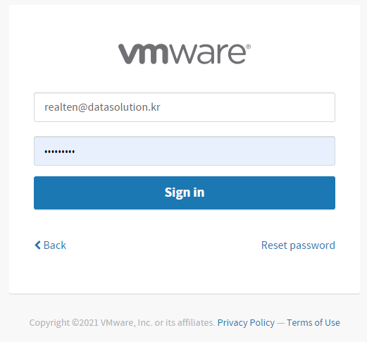
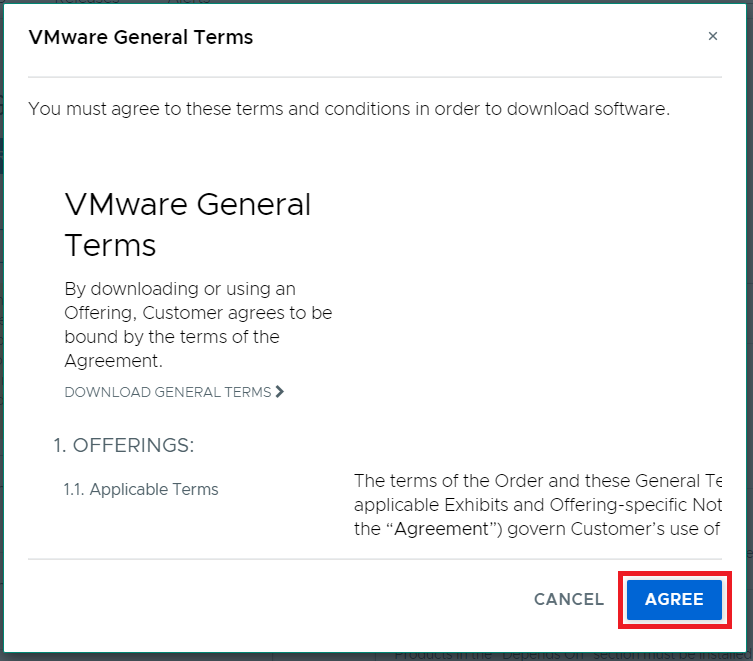
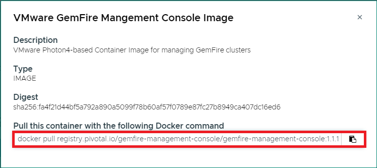

 

VMware GemFire Management Console은 VMware Network에서 제공합니다.

설치를 위해 [VMware Tanzu Network - VMware GemFire Management Console](https://network.tanzu.vmware.com/products/gemfire-management-console/)로 접속합니다.

다운로드 받기 위해 로그인합니다.

VMware에서 제공하는 소프트웨어를 다운로드하기 위해선 최종 라이센스 계약(EULA)를 서명해야 합니다.

Agree 버튼을 클릭합니다.

목록에서 VMware GemFire Management Console Image를 클릭합니다.

Image 경로를 복사합니다.

Kubernetes에 VMware GemFire Management Console을 배포하기 위해 아래와 같이 수행합니다.